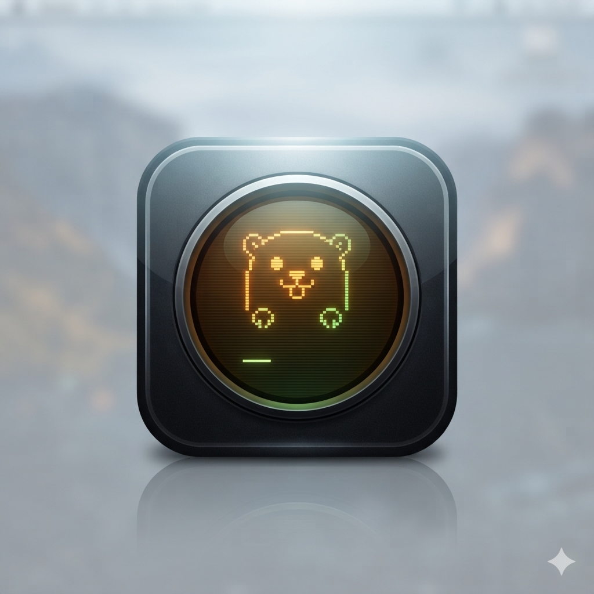
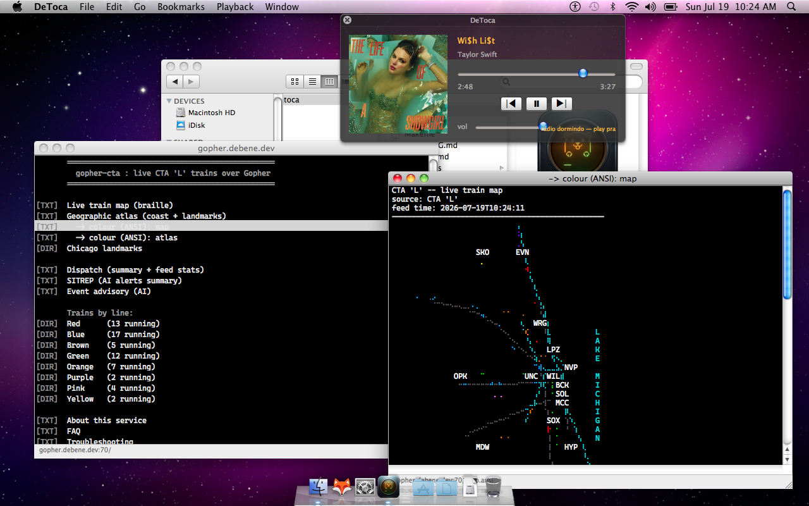
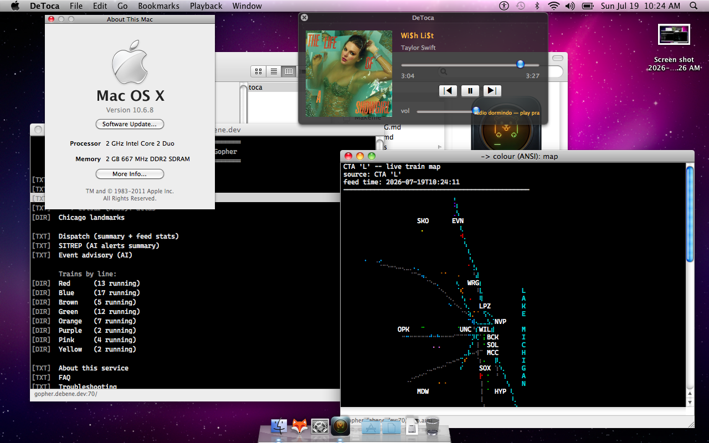

# DeToca

[](LICENSE)  





<details>
<summary><b>🕵️ Yes, it's a real Mac OS X 10.6.8 machine — proof</b></summary>

*About This Mac* on the actual MacBook2,1: **Mac OS X 10.6.8**, 2 GHz Intel Core 2 Duo, 2 GB DDR2.



</details>

A modern Gopher client for **Mac OS X 10.6 Snow Leopard** (MacBook2,1 /
Xcode 3.2.6 / GCC 4.2 / 10.6 SDK). The desktop sibling of DeBurrow (Android),
built for the debene gopherspace (`gopher.debene.dev:70`) and the wider Gopher
world. Bundle id: `dev.debene.detoca`.

Toca = burrow. Same family as DeBurrow.

[Companion Android App](https://github.com/felipedbene/deburrow)
## Why

The 10.6 Gopher ecosystem is effectively empty — TurboGopher is Classic-only,
and newer clients require newer macOS. DeToca fills that gap: RFC 1436 browsing,
multi-window navigation, and — the headline feature — correctly-aligned braille
maps with 256-color ANSI (the gopher-cta live CTA 'L' train maps).

> **Companion backend.** DeToca's "radinho" is the native client for
> **[gopher-spot](https://github.com/felipedbene/gopher-spot)** — Spotify Connect
> driven over Gopher, running on a homelab Kubernetes cluster. The player consumes
> its frozen **[`/spot/api/1` machine API](https://github.com/felipedbene/gopher-spot/blob/main/API.md)**;
> the client half is [fio 10](#the-full-radinho-fio-10).
>
> **Radinho siblings** — the same `/spot/api/1` client pattern, ported down the
> vintage ladder: **[DeGelato](https://github.com/felipedbene/degelato)** (Sorbet
> Leopard 10.5 / PowerPC) and **[Casquinha](https://github.com/felipedbene/casquinha)**
> (Mac OS 9.2 / classic Toolbox — the oldest machine yet). The recipe all three
> follow is [**fhb ▸ CLIENT-PATTERN.md**](https://github.com/felipedbene/fhb/blob/main/CLIENT-PATTERN.md).

## Building

Everything is plain `.h`/`.m` plus a Makefile. **No Xcode project, no NIBs** —
the whole UI is built in code, so the project reviews as plain diffs.

```sh
make            # build DeToca.app
make run        # build and launch
make test       # build & run the OCUnit (SenTestingKit) parser tests
make spikeb     # build the Spike B command-line fetch tool
make clean
```

The build targets i386 against the 10.6 SDK with `-mmacosx-version-min=10.6`
and compiles clean under `-Wall` (zero warnings). Override `ARCH`, `CC`, or
`SDK` on the command line if needed.

Requirements on the target: Xcode 3.2.6 (for GCC 4.2, the 10.6 SDK, and
`otest` + SenTestingKit under `/Developer`).

## Manual-memory / period-correct constraints

This is a **non-ARC** codebase using classic manual retain/release. It avoids
all modern Objective-C syntax (no `@[]`/`@{}`/`@42`/subscripting), uses explicit
`@synthesize` for every property, and builds with GCC 4.2 / LLVM-GCC. Blocks and
GCD are used sparingly and isolated (see below).

## Architecture

Two layers, cleanly separated:

**Parser layer — pure Foundation, no AppKit, unit-tested** (`make test`):

| Class | Responsibility |
|-------|----------------|
| `GopherItem` | One parsed gophermap line; type → kind + clickability. |
| `GopherMenuParser` | Menu text → `GopherItem[]`. CRLF/LF tolerant, `.`-terminated. |
| `GopherResource` | A resolvable location; parses `gopher://` URLs and bare `host/selector`. |
| `ANSIPalette` | The xterm 256-color palette (16 base + 6×6×6 cube + 24 gray). |
| `ANSISpan` | A styled run of text (RGB stored as bytes — no NSColor). |
| `ANSIParser` | SGR state machine → `ANSISpan[]`. |

**Networking:**

| Class | Responsibility |
|-------|----------------|
| `GopherRequest` | One RFC 1436 transaction on a background queue; main-thread delegate callbacks; 10s connect / 30s read timeouts; cancellable. BSD sockets (10.5-clean). |
| `DTDispatch` | The single wrapper around libdispatch (GCD). *10.6-only*, isolated so the fio-3 10.5 build can swap in an NSThread/NSOperationQueue path. |

**Player (fio 2) — the "radinho":**

| Class | Responsibility |
|-------|----------------|
| `StreamRouting` | Classifies a URL string as an in-app MP3 stream (pure Foundation, unit-tested). |
| `PlayQueueItem` / `PlayQueue` | Gopher-agnostic queue model: ordered (title, URL) items with a current index and next/prev/replace (pure Foundation, unit-tested). |
| `PLSParser` | Extracts the first stream URL from a PLS/M3U playlist (pure Foundation, unit-tested). |
| `StreamPlayerController` | Singleton dark HUD `NSPanel`. Two modes: QTKit finite-file queue (fio 2) and a live-stream mode (fio 5). Never imports the parser or gopher. |
| `DTAudioStreamer` | Live MP3 streaming via `AudioFileStream` + `AudioQueue` on a dedicated thread — what QTKit cannot do. Foundation + AudioToolbox, no AppKit. |
| `AppDelegate` (gopher side) | The gopher side of gopher-spot (fio 5/6): resolves the `.pls`, implements the player's `StreamControlDelegate` (transport → `/spot/control/*`), polls `/spot/now`, and drives the radinho's embedded browser (search + drill-down + play). There is no separate class — the player stays gopher-agnostic and the role lives on the `AppDelegate`. The modern fio 9/10 player is driven instead by the `/spot/api/1` machine API via `DTSpotAPI` (below). |
| `GopherMenuView` | Reusable dark-theme Gopher menu list (scroll view + table + cell recipe + activation delegate). Used by both the menu windows and the radinho browser. |
| `SpotSelectors` | Pure-Foundation helper: is a selector a gopher-spot "play" action (`/spot/play?…`, `…/control/play`) vs. drill-down? Unit-tested. |

**AppKit UI:**

| Class | Responsibility |
|-------|----------------|
| `AppDelegate` | Navigation hub; programmatic menu bar; the one `h`/`URL:` dispatch point. |
| `GopherWindowController` | One window per resource: menu (table) or text (ANSI) mode. |
| `AttributedStringRenderer` | `ANSISpan[]` → `NSAttributedString` (the AppKit half of the ANSI pipeline). |
| `GopherTableView` | Table subclass: Return/Enter activates a row. |
| `DTFontManager` | Registers bundled Cascadia Code; vends the document font. |
| `BookmarkStore` | Bookmarks as a hand-editable gophermap. |
| `PreferencesController` | Server host/port (fio 8) + resolved document font; dark skin (fio 9). |
| `DTServerPrefs` | Pure model: host/port validation, defaults, persistence (fio 8). |
| `DTMediaKeyRouter` | Pure decode/policy for the media keys (fio 8). |
| `DTMediaKeyTap` | Session `CGEventTap` capturing media keys on its own thread (fio 8). |
| `DTNowSnapshot` | Pure model/parser for the `/spot/api/1/now` snapshot; grew `album_id` + `device active\|idle` (fio 9/10). |
| `DTTrackItem` / `DTPlaylistItem` | Pure parsers for the v1 **list** responses — the shared `item.<i>.*` block (queue / search / playlist tracks) and the playlists list. Unit-tested (fio 10). |
| `DTSnapshotGuard` | Pure monotonic-`ts` guard: drops a snapshot from a staler replica so the seek bar never rewinds. Unit-tested (fio 10). |
| `DTCoverCache` | Two-level album-cover cache — `NSCache` + disk (`~/Library/Caches/dev.debene.detoca/covers/`), immutable, async, network fetch injected so it stays pure/testable (fio 10). |
| `DTSpotAPI` | Client of the **whole** `/spot/api/1` surface — state/transport, queue (+ add), search, playlists, wake, cover bytes — with the ts guard on `/now` (fio 9/10). |
| `DTPlayerWindowController` | The cover-forward player window on the API: big album cover, title/artist, seek/transport/volume, wake-on-idle (fio 9/10). |
| `DTPlaylistWindowController` | Modes — **Busca** (search) / **Fila** (queue) / **Playlists** — all on the machine API (fio 9/10). |
| `DTTrackCell` | Cell-based table row: 64px thumbnail + track/artist in DTTheme (10.6 has no view-based tables) (fio 10). |
| `DTTheme` | The one dark/amber CRT skin (palette + factories) (fio 9). |
| `DTInputSheet` | One-field input sheet (search / Open Location). |

## Design decisions

**One dark terminal theme everywhere.** Both menus and documents render on a
black background with light text. The gopher-cta maps are authored for a dark
terminal (their river/expressway colors are unreadable on white), and a gopher
"menu" is often really preformatted content — the askthedeck dcgi returns a
reading as info lines — so a single dark, monospaced surface keeps a page
looking identical whether it arrives as a type-0 document or a type-1 menu.
Explicit ANSI colors layer on top of the light default; unset text is light
grey; info/unknown/error rows are dimmed/tinted for the dark background.

**Menus render in an `NSTableView`, not an `NSTextView`.** The spec left this to
the implementer. A table gives first-class row selection, keyboard navigation
(arrow keys + Return via `GopherTableView`), per-row hit-testing, and trivially
inert info/error/unknown rows (`-tableView:shouldSelectRow:`) — all of which
would be fiddly to reproduce with link attributes in a text view. Rows use the
monospaced document font with zero intercell spacing (plus a few px so
descenders aren't clipped) so ASCII-art info lines — boxes, rules, the dcgi
tarot cards — align and their borders connect vertically. Type tags are
period-correct bracketed ASCII (`[DIR] [TXT] [FND] [WWW] [ERR] [ ? ]`), not
emoji, dimmed by kind.

**Text/ANSI documents** never wrap — the text container is unbounded and the
user scrolls horizontally for preformatted maps.

**Braille alignment (Spike A).** No stock 10.6 font carries the U+2800–U+28FF
braille block with correct advance width; Apple Symbols misaligns (10 vs 8 pt).
**Cascadia Code** (static TTF v2404.023) was the tested winner. It is bundled in
`Resources/`, registered at launch via `CTFontManagerRegisterFontsForURL`
(process scope, *10.6-only*), and is the default document font. The resolved
font name is shown in Preferences so misalignment is diagnosable. (DejaVu Sans
Mono does *not* carry the braille block — do not fall back to it.)

**The `ANSIParser` gets `38;5;n` right** — the fbterm "case 38" bug (swallowing
the parameters after a 256-color intro) is explicitly guarded and regression-
tested (`testCase38DoesNotSwallowFollowingParams`).

**fio-3 (10.5 / PowerPC) seams** are marked with `// 10.6-only:` comments and
kept small: GCD lives only behind `DTDispatch`; font registration is one call.

## Navigation model

TurboGopher-style: every menu link opens a **new window**, cascaded from its
parent. No back/forward — the window trail *is* the history. Cmd-W closes; the
Window menu lists open windows. Each window's title is the item's display
string; the status bar shows `host:port/selector`.

Shortcuts: **Cmd-Shift-H** Home (`gopher.debene.dev`), **Cmd-L** Open Location,
**Cmd-D** Add Bookmark, **Cmd-,** Preferences.

You can also launch straight to a location:

```sh
open DeToca.app --args gopher://gopher.debene.dev/0/map.ansi
```

## Streams — the radinho (fio 2)

gopher-spot serves menu items (`h`/`URL:`) pointing at HTTP MP3 streams. Clicking
one opens the **radinho**: a single global floating panel that plays in-app via
QTKit. The queue is built from **all** playable stream items in that menu, in
order, starting at the clicked item; auto-advance moves through them, and end of
queue parks on the last track. The panel is independent of browser windows —
**playback survives closing every menu window** and stops only when the panel is
closed or the app quits. A dead stream is skipped forward without an alert storm.

- **Routing** lives in the single fio-1 seam `-openExternalURLString:`: an
  http(s) URL whose path ends in `.mp3` plays in-app; everything else keeps the
  fio-1 external-handoff behavior.
- **Option-click always forces external open**, even for MP3 links (escape hatch).
- **Playback menu**: Play/Pause `⌥⌘P`, Previous `⌥⌘←`, Next `⌥⌘→` (global), plus
  Show Radinho. Space toggles play/pause only while the panel is key.
- **File ▸ Export Menu as Playlist…** writes the frontmost menu's stream items as
  Extended M3U (`#EXTM3U` / `#EXTINF:-1,<title>`) for use in an external player.
- Volume persists across relaunches (`NSUserDefaults`).

### Live streams + gopher-spot control plane (fio 5)

QTKit only plays *finite* HTTP files; it cannot play an endless live Icecast
stream (verified: `QTMovie` load state goes straight to error). So a type-`s`
(sound) item — gopher-spot's "Reabrir stream" → a `.pls` — is played by
**`DTAudioStreamer`**, a CoreAudio (`AudioFileStream` + `AudioQueue`) streamer.
AudioToolbox is on 10.5, so this stays fio-3 friendly.

gopher-spot is dual-plane: one persistent Icecast audio stream plus a gopher
**control plane**. Activating a type-`s` item resolves the `.pls` over gopher,
plays the stream, and wires the panel to the control plane via the
`AppDelegate`'s gopher-spot control (derived by convention from the stream
selector's parent — `/spot/stream.pls` → `/spot/control/{play,pause,next,prev}`,
`/spot/now`):

- The radinho's transport buttons fire gopher `/spot/control/*` requests (so
  Next skips the upstream Spotify), and the now-playing title is polled from
  `/spot/now`. The player itself stays gopher-agnostic — all gopher knowledge
  lives in the `AppDelegate`, which is the player's `StreamControlDelegate`.
- Playback survives closing the browser window; closing the panel stops it.

### The radinho as a gopher-spot menu (fio 6)

Activating the type-`s` stream item doesn't just play — it **expands the radinho
into an embedded gopher-spot browser**. The panel grows: transport controls on
top, then a search field, then a scrollable menu list seeded at the gopher-spot
root. It's a small generic Gopher browser (fetch → render → drill-down stack +
Back + search) pointed at the control host, reusing `GopherMenuView`, with one
gopher-spot-specific hook: activating a **play** selector (`/spot/play?…` or
`…/control/play`, detected by `SpotSelectors`) ensures the local stream is
playing so you hear it. Search sends `/spot/search␉query`; artists/albums/tracks
drill down to their detail pages; `>> Tocar agora` plays. The player stays
gopher-agnostic — it only hosts an opaque browse view; all gopher logic lives on
the `AppDelegate`.

### The Radinho is the star (fio 7)

DeToca opens **straight to the Radinho** — the literal Spotify-over-gopher
client. On launch it connects to the configured gopher-spot address and shows the
player + embedded browser; no gopher window unless you want one. The address is a
preference (`NSUserDefaults` keys `DTSpotHost` / `DTSpotPort` /
`DTSpotStreamSelector`, defaulting to the debene homelab). **Playback ▸ Open
Radinho** (Cmd-R) reveals or reconnects it. Gopher browsing is still one click
away — **Go ▸ Home** (Cmd-Shift-H), **Open Location…** (Cmd-L), or a `gopher://…`
launch argument — it's just no longer the front door.

### Preferences + media keys (fio 8)

**Preferences** (Cmd-,) grew a **gopher-spot Server** section: **Host** and
**Port** fields backed by the same `DTSpotHost` / `DTSpotPort` defaults (so a
legacy `defaults write dev.debene.detoca DTSpotHost …` still works, and the
window reads/writes the very same values). Save is disabled until the host is
non-empty and the port is 1–65535. **Test Connection** fetches the gopher root
menu of the entered address over the normal socket path (not the `/spot/api/1`
machine API) and reports latency or a readable error, without blocking the UI.
Saving a *changed* address reconnects the radinho — the same path as Cmd-R.
Validation and the host/port model live in the pure, unit-tested `DTServerPrefs`.

The MacBook keyboard's **media keys** (⏮ ⏯ ⏭) drive the radinho, firing the
exact same actions as the panel buttons and the Playback menu. ⏯ toggles
play/pause when live, or revives + starts the radinho when idle (Cmd-R + play);
⏭ / ⏮ are silent no-ops when nothing is connected. Capture is a
`kCGSessionEventTap` for `NX_SYSDEFINED` (subtype-8 aux buttons) on a dedicated
run-loop thread (`DTMediaKeyTap`), so it survives modal sheets and works even
when DeToca isn't frontmost; the event is *consumed* so iTunes doesn't launch on
⏯. On 10.6 this needs no "assistive devices" toggle. Decode + policy are the
pure, unit-tested `DTMediaKeyRouter`. While DeToca runs it owns these keys
globally (no most-recent-media-app arbitration — a deliberate simplification).

### The radinho becomes a player (fio 9)

Through fio 6–7 the radinho was a gopher *browser* with a transport strip — to do
anything you drilled through menus, and it looked like anything but a player. fio
9 rebuilds it as a **WinAmp-style player driven by the frozen `/spot/api/1`
machine API** (fio S1), which is now the source of truth for playback state and
transport.

- **`DTSpotAPI` + `DTNowSnapshot`** — the data layer. It polls `/now` (state,
  track/artist/album, `position_ms`/`duration_ms`, `volume`, `queue_len`, `ts`)
  and drives `play`/`pause`/`next`/`prev`/`volume`/`seek`. The snapshot parser is
  pure and unit-tested; unknown keys are ignored (the v1 freeze).
- **Player window** (`DTPlayerWindowController`) — a compact dark HUD: a marquee
  now-playing line (amber while playing), an **interactive seek bar** (position
  interpolated between polls via `ts`, drag to `/seek`), elapsed/duration,
  transport (→ the API), and a volume slider (→ device `/volume`). Audio is still
  the Icecast stream via `DTAudioStreamer`; the API drives Spotify upstream.
- **Playlist window** (`DTPlaylistWindowController`) — a clean search box → a
  **flat, playable track list**, no menu drilling: `/spot/search` results are
  flattened to tracks and each row's `/spot/track/<id>` becomes a direct
  `/spot/play?uri=spotify:track:<id>` action. Opened with **Cmd-Y**.
- **`DTTheme`** — one dark/amber CRT skin (the palette + Cascadia + an amber
  accent from the app icon), applied to the player, playlist and a repainted-dark
  Preferences; the fio-8 media keys drive the player's API transport.

At fio 9 the real "up next" queue and cover art weren't in the v1 API yet (only
`queue_len`), so the playlist showed search results — those land in **fio 10**
(below). The gopher browse is demoted: a `[SND]` link opens the player, and gopher
browsing stays available through ordinary gopher windows. `StreamPlayerController`
(fio 2/5) remains only for the MP3-file queue of `h`/`URL:` links.

### The full Radinho (fio 10)

By fio 9 the server-side machine API had grown well past what the client used:
gopher-spot's [fio S1–S3](https://github.com/felipedbene/gopher-spot) added the
queue, album covers, track search, `device`/`wake`, and playlists. **fio 10**
consumes all of it, finishing the Radinho as a real music client — still pure
10.6 / Xcode 3.2.6, non-ARC, programmatic UI, zero server change. See the
[machine-API contract](https://github.com/felipedbene/gopher-spot/blob/main/API.md).

- **Data layer (`DTSpotAPI` + pure models).** `DTSpotAPI` now covers the whole
  `/spot/api/1` surface — `queue`/`queue/add`, `search`, `playlists` (paged),
  `wake`/`wake?play=1`, context play, and raw `cover` JPEG bytes (split from the
  text-error body by the `FF D8` SOI marker). The v1 list responses parse through
  the pure, unit-tested `DTTrackItem` / `DTPlaylistItem`. A **monotonic-`ts`
  guard** (`DTSnapshotGuard`) drops a `/now` from a staler replica — the server
  runs two pods, each with a ~1 s `/now` micro-cache behind a load balancer, so
  consecutive polls can return a `ts` slightly out of order; the guard means the
  seek bar never rewinds. `DTNowSnapshot` grew `album_id` and `device`.
- **Cover-forward player.** The player is rebuilt around a **big album cover** on
  the left (a fixed landscape window); title and artist sit on **separate lines**
  (killing the old middle-truncation), and the cover is the one colored area in
  the dark skin. The cover changes only when `album_id` changes and is cached in
  memory + on disk (immutable), so a track change inside the same album never
  refetches and a relaunch loads it from disk. No art → the amber CRT gopher
  placeholder.
- **Playlist window in modes** (`Busca | Fila | Playlists`, still Cmd-Y). **Busca**
  now hits `/spot/api/1/search` — the *last* human-menu parse in the app is gone;
  results render with 64px thumbnails and each row can **play (▶ Tocar)** or
  **enqueue (＋ Fila → `queue/add`)**. **Fila** shows the live "up next" queue with
  thumbnails, refreshed off the player's existing `/now` poll (no second timer) and
  after an add; an empty queue shows the automatic-radio state. **Playlists** lists
  all 155 (paged + session-cached) and plays one **as a context** (`context_uri`),
  so next/prev follow the playlist order — there's no track drill-down because
  Spotify 403s playlist reads for this app in dev-mode.
- **Wake on idle.** When `/now` reports `device idle` (the audio device drifted to
  the phone, or librespot dropped) the footer nudges "rádio dormindo — play pra
  acordar"; pressing play (or a media key) calls `wake?play=1` to pull playback
  back onto the gopher-spot device. `no_device` (librespot down) shows an honest
  "rádio fora do ar", no crash.

Thumbnails and covers come from `DTCoverCache`; rows draw through `DTTrackCell`.
Everything off the main thread; 92 OCUnit tests green; zero leaks.

## Bookmarks

Stored as a plain-text gophermap at
`~/Library/Application Support/DeToca/bookmarks.gophermap` and rendered through
the ordinary menu path. Hand-editable — it's just a gophermap.

## Scope (fio 1)

**In:** protocol core; item types 0/1/7/i/h/3 + unknown; multi-window nav; menu
& text rendering; ANSI + 256-color + braille; bookmarks; Home; Open Location.

**Out (later fios):** in-app QTKit stream player (fio 2 — swaps in at
`-openExternalURLString:`); universal ppc/i386 10.5 build (fio 3); images,
binary downloads, Gopher+, caching, TLS, tabs.

## Icon (fio 4)

`Resources/DeToca.icns` — a dark rounded tile with an amber CRT "scope" showing a
pixel-art gopher wearing headphones (browser + radinho in one glyph). Chosen from
two candidates in `design/` for legibility at Dock/Finder sizes; the amber
line-art reads more clearly when shrunk than the green matrix alternative
(`design/icon-green-matrix.png`). The tile was cropped from the source render and
its corners masked to transparency (`design/icon-amber-gopher-tile.png`), then
built into a multi-size `.icns` and referenced via `CFBundleIconFile`. To rebuild
from a different source, regenerate the `.iconset` and run `iconutil -c icns`.

## Font license

Cascadia Code is bundled under the SIL Open Font License 1.1
(`Resources/OFL.txt`).

---
### Part of the gopher constellation
**Servers & tools:** [gopher-core](https://github.com/felipedbene/gopher-core) · [gopher-cta](https://github.com/felipedbene/gopher-cta) · [gopher-blog](https://github.com/felipedbene/gopher-blog) · [gopher-askthedeck](https://github.com/felipedbene/gopher-askthedeck) · [gopher-spot](https://github.com/felipedbene/gopher-spot) · [the-economist-epub](https://github.com/felipedbene/the-economist-epub)
**Clients:** [casquinha](https://github.com/felipedbene/casquinha) (Mac OS 9) · [detoca](https://github.com/felipedbene/detoca) (OS X 10.6) · [degelato](https://github.com/felipedbene/degelato) (OS X 10.5 PPC) · [deburrow](https://github.com/felipedbene/deburrow) (Android)
**Protocol notes:** [fhb](https://github.com/felipedbene/fhb)
---
